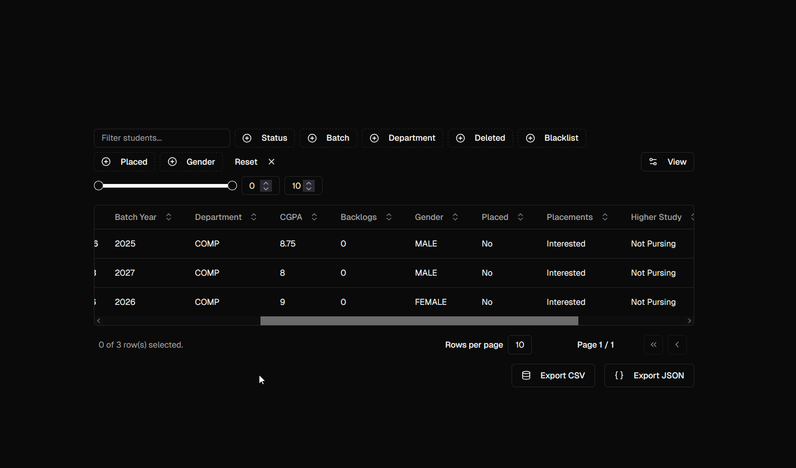

   
    
   
  <h3 align="center">Convex ShadCN Table Demo</h3>

## Technologies

1. Next `15` + Tailwind v4: Frontend (No API routes since convex)
2. Typescript: All the way type safe
3. Convex: Backend and reactive database
4. Vercel for hosting and amazing font

## Acknowledgements

I didn't know how to implement it hence why, I made this

1. ShadCN and Radix UI
2. Tanstack Table and Zod and `react-hook-form`
3. [Multiselect component](https://shadcn-multi-select-component.vercel.app/)
4. [Sign up form](https://ui.indie-starter.dev/form-builder)
5. [ShadCN Date Picker](https://time.rdsx.dev/)
6. [Password Compare](https://github.com/shadcn-ui/ui/pull/3452)

## Contributions & Issues

Highly welcomed!
